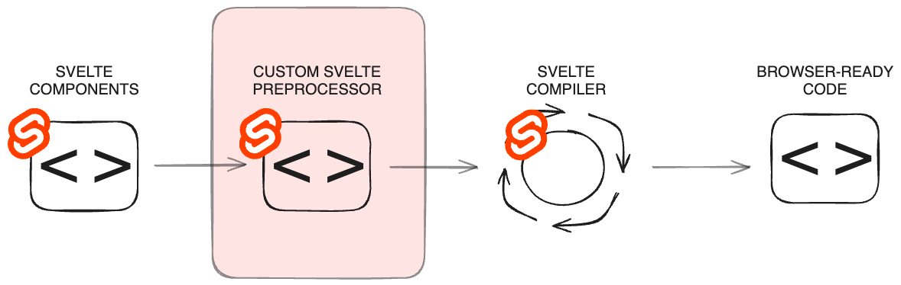
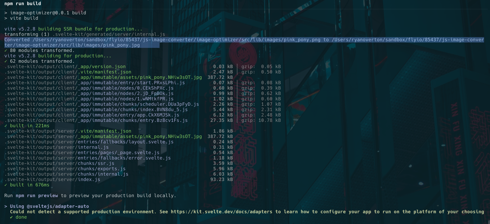
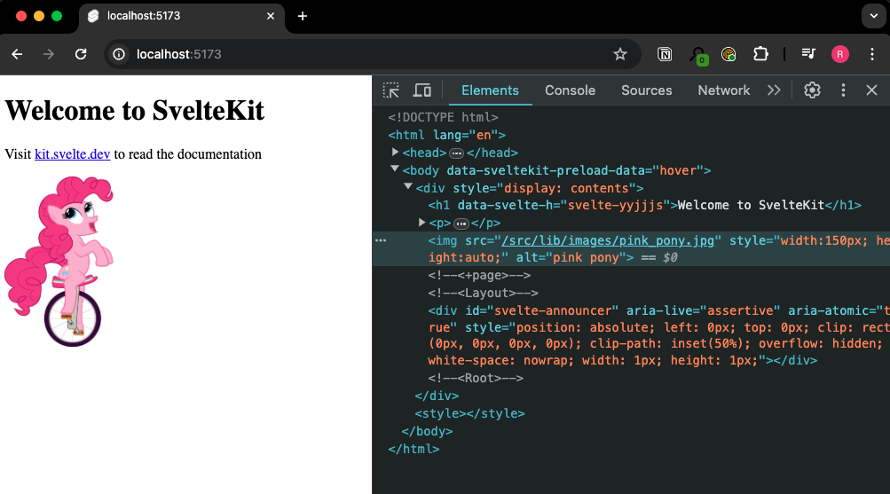

# Solving Image Conversion with a Custom Svelte Preprocessor

Been diving into Svelte? You get its lightning-fast UI building magic, right? It zips through with compile-time wizardry, leaving sleek runtime code.

Yet despite its efficient code, Svelte still faces a classic web developer issue: large images. But no worries! Svelte's got this awesome feature you can use to tackle the issue!

## Problem

Dealing with inappropriate image types or sizes on your website is a longstanding issue, and I can vouch for that firsthand.

Back in the early internet era, when connection speeds were measured in kilobytes, keeping images small was crucial to prevent slowing down entire web pages, much to the frustration of users. Larger images, around 1-2 megabytes, would load line by line, testing the patience of visitors.

<center><figure>
    
    <figcaption>Image provided via <a href="https://giphy.com/gifs/meme-internet-QIQTfximd3AuQ">GIPHY</a></figcaption>
</figure></center>
<br>

Today, with blazing gigabit internet speeds, you might think this isn't such a big deal anymore. But it's actually more critical than many realize. Studies reveal that for web pages taking over 2-3 seconds to load, the [abandonment rate](https://www.hobo-web.co.uk/your-website-design-should-load-in-4-seconds/) can soar to a staggering 87%, with each additional second significantly increasing the likelihood of abandonment.

One way to optimize images is to use PNGs instead of JPEGs. Although both formats [support up to 16 million colors](https://www.adobe.com/creativecloud/file-types/image/comparison/jpeg-vs-png.html#what-is-a-jpeg-file), PNGs typically have [larger file sizes](https://www.adobe.com/creativecloud/file-types/image/comparison/jpeg-vs-png.html#what-is-the-difference-between-jpeg-and-png-files) due to their compression process, resulting in longer download times.

Rather than relying on the design team for JPEG images, risking delays and disrupting the precarious design-engineering balance, let's do what engineers do best: automate it! Oh and while we're at it, let's make it a part of our build process because who wants to remember to do this every time.

So, how can we make this all happen?

## Solution

By utilizing a feature of the Svelte build process known as the [preprocess function](https://svelte.dev/docs/svelte-compiler#preprocess), we have access to convenient hooks for transforming component source code before it's run through the Svelte compiler. This lets us create a custom preprocessor to convert the images, seamlessly updating the corresponding `` tags within our Svelte components.



While we're developing our custom preprocessor, we'll keep all the code in the `vite.config.js` file. No need to add additional complexity until we're sure it's going to work. However, once it is complete and proving useful, consider sharing it with the community and contributing to the Svelte ecosystem over at [Svelte Society](https://sveltesociety.dev).

To begin, add the `svelte-parse-markup` package and `jimp` package to your solution. This will provide us the capability to parse the markup found within Svelte components and convert our images.

```Bash
npm install --save-dev 'svelte-parse-markup' 'jimp'
```

Now, let's write some code. In the `vite.config.js` file, add the following.

```JavaScript
import * as fs from 'node:fs';
import * as path from 'node:path';
import Jimp from "jimp";

...

async function convertToJpg(original_url, opts) {
	const newUrl = original_url.replace('.png', '.jpg');
	if (fs.existsSync(path.resolve(opts.vite_config.publicDir, newUrl))) {
		return newUrl;
	}
	Jimp.read(original_url)
		.then((img) => {
			return img
			.write(newUrl);
		})
		.catch((err) => {
			console.error(err);
		});
    console.log(`\nConverted ${original_url} to ${newUrl}`);
	return newUrl;
}
```

This code handles the conversion of our images from PNG to JPEG format. What's great about this code is its framework-agnostic nature, making it applicable to any JavaScript-based framework you might be working with! 

Additionally, it checks for the presence of a corresponding JPEG version to save build time by avoiding duplicate conversions. It also prevents a unique ~~quirk~~ "feature" that appears when utilizing the hot module replacement feature (HMR) during development: infinite loops. This occurs because HMR monitors the filesystem, restarting the build process upon detection of a newly created file. You could end up going like the wheels on the bus, round and round.

Next, add the code to find the images needing conversion. 

```JavaScript
import { parse } from 'svelte-parse-markup';
import { asyncWalk } from 'estree-walker';
import MagicString from 'magic-string';

...

function customPreprocessor(opts) {
	return {
		async markup({ content, filename }) {
            if (!content.includes(' v.type === 'Attribute' && v.name === 'src')?.value[0];
                            const url = src.raw.trim();
                            const resolved_image_path = (await opts.context.resolve(url, filename))?.id;
                            const newUrl = await convertToJpg(resolved_image_path, opts);
                            
                            const name = `test${++imgCount}`;
                            const import_text = `import ${name} from "${newUrl}"`;

                            if (ast.instance) {
								ms.appendLeft(ast.instance.content.start, import_text);
							} else {
								ms.append(`<script>${import_text}</script>`);
							}
                            ms.update(src.start - 1, src.end + 1, `{${name}}`);
                            return;
                        }
                    }
                }
            });
            return {
                code: ms.toString(),
                map: ms.generateMap()
            };
        }
    }    
}
```

This code will parse the markup content, identify `` elements, resolve their source paths, and convert them to JPEG. Additionally, it adds a dynamic import statement reference to the converted images and updates the references in the markup.

Then include the specification for our custom preprocessor. Here, we outline the hooks we'll be attaching to.

```JavaScript
function imagePreprocessor() {

	const opts = {
		context: undefined,
		config: undefined
	};

	return {
		name: 'svelte-image-optimizer',
		api: {
			sveltePreprocess: customPreprocessor(opts)
		},
		configResolved(config) {
			opts.config = config;
		},
		buildStart() {
			opts.context = this;
		}
	}
}
```

Finally, update the `defineConfig` function to let it know about the new preprocessor.

```JavaScript
export default defineConfig({
	plugins: [imagePreprocessor(), sveltekit()]
});
```

With this update, simply test by running the build command and checking the output log for converted images. 



Furthermore, you can verify the markup update by checking the image element in your browser's developer tools to ensure it references the JPEG file.



## Discussion
Congratulations, you've successfully built a basic image preprocessor and plugged it into Svelte!

To further enhance this plugin, you can add additional functionality to adjust the actual size of the image to be only what is needed based on set width and heights, or better yet, generate multiple image sizes to correspond to the various screen resolutions. Delivering the best image for the device viewing the web page.